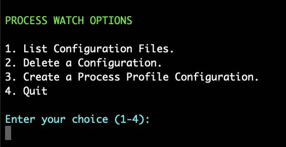
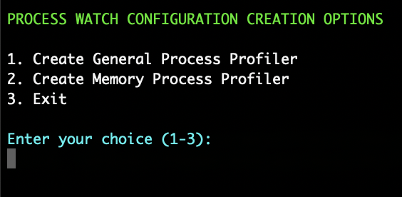
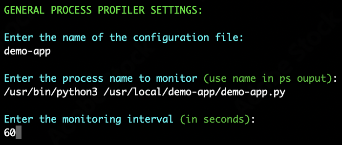
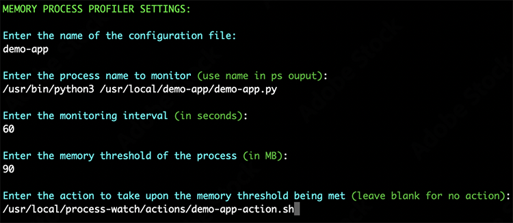

# PROCESS WATCH
* License: (Apache 2.0), Copyright (C) 2025, Author Phil Chen
    * The author or owner of this repository is not liable for damages or losses arising from your use or inability to use the code.

## DESCRIPTION
Process Watch monitors processes and workflows in your Linux system for anomalies or situations which when arise trigger predetermined actions you designate.

This is useful for systems issues, automating troubleshooting, provisioning, scaling, and much more.

## PREREQUISITES
Python 3.11 or higher

## INSTALLATION

### Install Process Watch on Ubuntu

1. `gunzip -c process-watch.tar.gz | tar -xvf - `
2. `mv process-watch /usr/local/`
3. `cd /usr/local/process-watch`
4. `pip install -r requirements.txt`
5. `/usr/local/process-watch/tools/config_tool.py`
6. `cd /usr/local/process-watch/systemd`
7. `sudo cp process_watch.service /etc/systemd/system/`
8. `sudo systemctl daemon-reload`
9. `sudo systemctl enable process_watch`
10. `sudo systemctl start process_watch`

## CONFIGURATION

Configuring Process Watch is done through a configuration tool located in the tools directory. The configuration tool will give you several options to create or manage configurations.

1. `python3 /usr/local/process-watch/tools/config_tool.py`

### Configure Process Profile Configuration

Process profilers are the different functionalities Process Watch offers based on process utilization. Any time you make a new configuration via the configuration tool you must restart Process Watch by executing `sudo systemctl restart process_watch` for the new config to take effect.

You can access the Process Profile Configuration menu from the main menu by choosing the option "Create a Process Profile Configuration".

### Create General Process Profiler

The General Process Profiler, will monitor the process you dictate at the interval you specify and write a process specific CPU and memory utilization log entry in the logs directory under the naming convention `your-file-name-general-profile.log`.

You can create a General Process Profiler via the Process Profile Configuration menu by choosing the option "Create General Process Profiler".

See the following example below for configuration options:

### Create Memory Process Profiler

The Memory Process Profiler, will monitor the memory utilization for the process you dictate at the interval you specify and write a log entry when you exceed a memory threshold you define in the logs directory under the naming convention `your-file-name-memory-profile.log`. If you choose the Memory Process Profiler also will take action when the memory threshold is exceeded. We recommend you write a shell script for the wanted action.

You can create a Memory Process Profiler via the Process Profile Configuration Menu by choosing the option "Create Memory Process Profiler".

See the following example below for configuration options:

