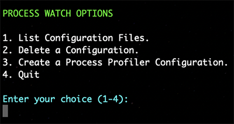
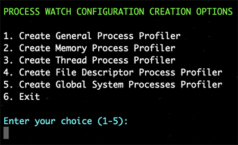
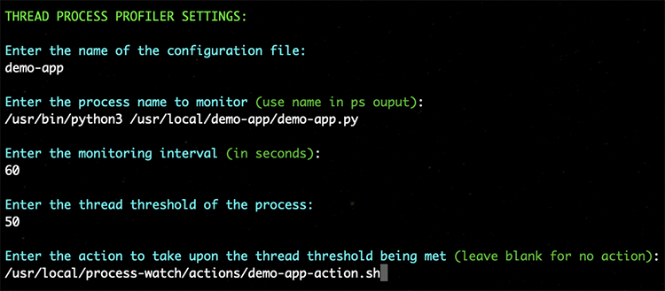
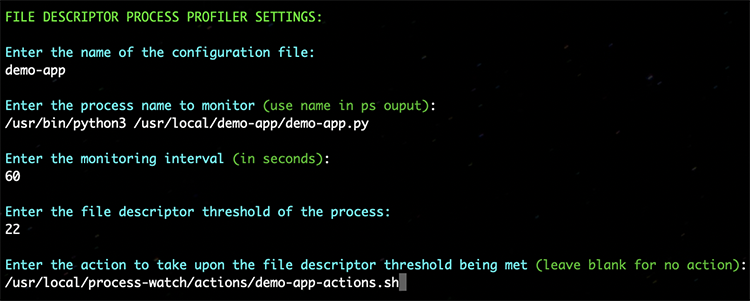
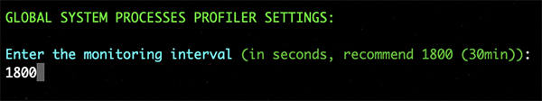

# PROCESS WATCH
* License: (Apache 2.0), Copyright (C) 2025, Author Phil Chen
    * The author or owner of this repository is not liable for damages or losses arising from your use or inability to use the repository/code.

## DESCRIPTION
Process Watch monitors individual processes in your Linux or macOS system for metrics such as CPU, Memory, Threads, File Descriptors. You can set a predetermined action of your choosing when a threshold is met.

Process Watch is useful for diagnosing systems issues caused by specific processes, automating troubleshooting, triggering scaling, and much more.

The Open Source version of Process Watch is meant to be managed manually or with a provisioning/configuration management tool. There are future plans for a single pane of glass dashboard for easier visibility.

## PREREQUISITES
* Operating Systems: Ubuntu 20.04+, macOS 15.4.1+
* Python 3.10.9+ and pip 22.3.1+

## INSTALLATION

### Install Process Watch on Ubuntu

1. `sudo apt -y update`
2. `sudo apt -y install build-essential openssl`
3. `sudo apt -y install libpq-dev libssl-dev libffi-dev zlib1g-dev`
4. `sudo apt -y install python3-pip python3-dev`
5. `sudo apt -y install virtualenvwrapper`
6. `cd /home/ubuntu`
7. `virtualenv process_watch_env`
8. `source process_watch_env/bin/activate`
9. `wget https://github.com/systemswatch/process-watch/archive/refs/tags/1.0.tar.gz`
10. `gunzip -c 1.0.tar.gz | tar -xvf -`
11. `sudo mv process-watch-1.0 /usr/local/process_watch`
12. `cd /usr/local/process_watch`
13. `pip install -r requirements.txt`
   * Skip step 13 and go to step 14 if you are running process_watch as root 
14. `sudo apt install python3-psutil`
   * Skip step 14 if your running as a non-root user
15. `/usr/local/process_watch/tools/config_tool.py`
16. `cd /usr/local/process_watch/systemd`
17. `sudo cp process_watch.service /etc/systemd/system/`
   * (Make sure to edit the process_watch.service file with your chosen user and group)
18. `sudo systemctl daemon-reload`
19. `sudo systemctl enable process_watch`
20. `sudo systemctl start process_watch`

## CONFIGURATION

Configuring Process Watch is done through a command line configuration tool located in the tools directory. The configuration tool will give you several options to create or manage configurations.

`python3 /usr/local/process-watch/tools/config_tool.py`

### Configure Process Profiler Configuration

Process profilers are the different functionalities Process Watch offers based on process utilization. Any time you make a new configuration via the configuration tool you must restart Process Watch by executing `sudo systemctl restart process_watch` for the new config to take effect.

You can access the Process Profiler Configuration menu from the main menu by choosing the option "Create a Process Profiler Configuration".

### Create General Process Profiler

The General Process Profiler, will monitor the process you dictate at the interval you specify and write CPU, RSS memory usage, file descriptor, and thread count log entry in the logs directory under the naming convention `your-file-name-gen-profiler.log`.

You can create a General Process Profiler via the Process Profiler Configuration menu by choosing the option "Create General Process Profiler".

See the following example below for configuration options:

### Create Memory Process Profiler

The Memory Process Profiler, will monitor the memory utilization for the process you dictate at the interval you specify and write a log entry when you exceed a memory threshold you define in the logs directory under the naming convention `your-file-name-mem-profiler.log`. Memory Process Profiler can also take action when the memory threshold is exceeded. We recommend you write a shell script for the wanted action or actions upon exceeding the memory threshold.

**Actions**

If you choose to have an action triggered we recommend you write a shell script for the action and put it in the actions directory. The shell script can be bash or language of your choosing as long as its **executable** and can be called by its path (ex. `/usr/local/process-watch/actions/xyz-action.sh`), also ensure the script has an interpreter defined (ex. `#!/bin/bash`). Example actions could be restarting the process, collecting troubleshooting info, notification or anything you need during when the threshold is met.

You can create a Memory Process Profiler via the Process Profiler Configuration Menu by choosing the option "Create Memory Process Profiler".

See the following example below for configuration options:

### Create Thread Process Profiler

The Thread Process Profiler, will monitor the thread utilization for the process you dictate at the interval you specify and write a log entry when you exceed a thread threshold you define in the logs directory under the naming convention `your-file-name-thrd-profiler.log`. Thread Process Profiler can also take action when the thread threshold is exceeded. We recommend you write a shell script for the wanted action or actions upon exceeding the thread threshold.

**Actions**

If you choose to have an action triggered we recommend you write a shell script for the action and put it in the actions directory. The shell script can be bash or language of your choosing as long as its **executable** and can be called by its path (ex. `/usr/local/process-watch/actions/xyz-action.sh`), also ensure the script has an interpreter defined (ex. `#!/bin/bash`). Example actions could be restarting the process, collecting troubleshooting info, notification or anything you need during when the threshold is met.

You can create a Thread Process Profiler via the Process Profiler Configuration Menu by choosing the option "Create Thread Process Profiler".

See the following example below for configuration options:

### Create File Descriptor Process Profiler

The File Descriptor Process Profiler, will monitor the file descriptor utilization for the process you dictate at the interval you specify and write a log entry when you exceed a file descriptor threshold you define in the logs directory under the naming convention `your-file-name-fds-profiler.log`. File Descriptor Process Profiler can also take action when the file descriptor threshold is exceeded. We recommend you write a shell script for the wanted action or actions upon exceeding the file descriptor threshold.

**Actions**

If you choose to have an action triggered we recommend you write a shell script for the action and put it in the actions directory. The shell script can be bash or language of your choosing as long as its **executable** and can be called by its path (ex. `/usr/local/process-watch/actions/xyz-action.sh`), also ensure the script has an interpreter defined (ex. `#!/bin/bash`). Example actions could be restarting the process, collecting troubleshooting info, notification or anything you need during when the threshold is met.

You can create a File Descriptor Process Profiler via the Process Profiler Configuration Menu by choosing the option "Create File Descriptor Process Profiler".

See the following example below for configuration options:

### Create Global System Processes Profiler

The Global System Processes Profiler, will monitor all processes globally and find the top 5 consumers of Memory (RSS), CPU, Threads, and File Descriptors and log them in the logs directory under the naming convention `glbl-sys-procs-profiler.log`. 

You can create a File Descriptor Process Profiler via the Process Profiler Configuration Menu by choosing the option "Create File Descriptor Process Profiler".

See the following example below for configuration options:

### Quick Notes

* If you are using systemd and the supplied `process_watch.service` file make sure to change the user and group to your choosing.
* Logs are stored in `/usr/local/process_watch/logs`
* Each profiler has its own log file.
* If you need access to see the contents of individual Profiler Configuration files they are located at `/usr/local/process_watch/watch_list` under the configuration file name you provided upon creation.
* CPU actions are not their yet because we are still looking at the proper situation to take action on a process CPU utilization since often times it will spike to 100% however that doesn't mean a process needs action taken.
