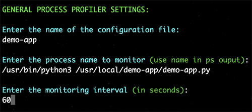

# PROCESS WATCH
* License: (Apache 2.0), Copyright (C) 2025, Author Phil Chen
    * The author or owner of this repository is not liable for damages or losses arising from your use or inability to use the code.

## DESCRIPTION
Process Watch monitors processes in your Linux or macOS system for anomalies or situations which when arise trigger predetermined actions you designate.

This is useful for systems issues, automating troubleshooting, provisioning, scaling, and much more.

The Open Source version of Process Watch is meant to be managed manually or with a provisioning or configuration management tool. There are plans for a single pane of glass dashboard for easier visibility. 

## PREREQUISITES
* Ubuntu 20.04+
* macOS 15.4.1
* Python 3.11 or higher

## INSTALLATION

### Install Process Watch on Ubuntu

1. `gunzip -c process-watch.tar.gz | tar -xvf - `
2. `mv process-watch /usr/local/`
3. `cd /usr/local/process-watch`
4. `pip install -r requirements.txt`
5. `/usr/local/process-watch/tools/config_tool.py`
6. `cd /usr/local/process-watch/systemd`
7. `sudo cp process_watch.service /etc/systemd/system/`
8. `sudo systemctl daemon-reload`
9. `sudo systemctl enable process_watch`
10. `sudo systemctl start process_watch`

## CONFIGURATION

Configuring Process Watch is done through a configuration tool located in the tools directory. The configuration tool will give you several options to create or manage configurations.

`python3 /usr/local/process-watch/tools/config_tool.py`

### Configure Process Profiler Configuration

Process profilers are the different functionalities Process Watch offers based on process utilization. Any time you make a new configuration via the configuration tool you must restart Process Watch by executing `sudo systemctl restart process_watch` for the new config to take effect.

You can access the Process Profiler Configuration menu from the main menu by choosing the option "Create a Process Profiler Configuration".

### Create General Process Profiler

The General Process Profiler, will monitor the process you dictate at the interval you specify and write CPU, RSS memory usage, file descriptor, and thread count log entry in the logs directory under the naming convention `your-file-name-gen-profiler.log`.

You can create a General Process Profiler via the Process Profiler Configuration menu by choosing the option "Create General Process Profiler".

See the following example below for configuration options:

### Create Memory Process Profiler

The Memory Process Profiler, will monitor the memory utilization for the process you dictate at the interval you specify and write a log entry when you exceed a memory threshold you define in the logs directory under the naming convention `your-file-name-mem-profiler.log`. Memory Process Profiler can also take action when the memory threshold is exceeded. We recommend you write a shell script for the wanted action or actions upon exceeding the memory threshold.

You can create a Memory Process Profiler via the Process Profiler Configuration Menu by choosing the option "Create Memory Process Profiler".

See the following example below for configuration options:

### Create Thread Process Profiler

The Thread Process Profiler, will monitor the thread utilization for the process you dictate at the interval you specify and write a log entry when you exceed a thread threshold you define in the logs directory under the naming convention `your-file-name-thrd-profiler.log`. Thread Process Profiler can also take action when the thread threshold is exceeded. We recommend you write a shell script for the wanted action or actions upon exceeding the thread threshold.

You can create a Thread Process Profiler via the Process Profiler Configuration Menu by choosing the option "Create Thread Process Profiler".

See the following example below for configuration options:

### Create File Descriptor Process Profiler

The File Descriptor Process Profiler, will monitor the file descriptor utilization for the process you dictate at the interval you specify and write a log entry when you exceed a file descriptor threshold you define in the logs directory under the naming convention `your-file-name-fds-profiler.log`. File Descriptor Process Profiler can also take action when the file descriptor threshold is exceeded. We recommend you write a shell script for the wanted action or actions upon exceeding the file descriptor threshold.

You can create a File Descriptor Process Profiler via the Process Profiler Configuration Menu by choosing the option "Create File Descriptor Process Profiler".

See the following example below for configuration options:

### Create Global System Processes Profiler

The Global System Processes Profiler, will monitor all processes globally and find the top 5 consumers of Memory (RSS), CPU, Threads, and File Descriptors and log them in the logs directory under the naming convention `glbl-sys-procs-profiler.log`. 

You can create a File Descriptor Process Profiler via the Process Profiler Configuration Menu by choosing the option "Create File Descriptor Process Profiler".

See the following example below for configuration options:

### Quick Notes

* Logs are stored in `/usr/local/process_watch/logs`
* Each profiler has its own log file.
* If you need to run Process Watch as a non-root user simply modify the systemd file swapping root for your user.
* If you need to run your Process Watch action as a non-root user enable it via sudo in your action shell script.
* If you need access to see the contents of individual Profiler Configuration files they are located at `/usr/local/process_watch/watch_list` under the configuration file name you provided upon creation.
* We are still looking at how to take action on a process CPU utilization since often times it will spike to 100% however that doesn't mean it needs action taken.
