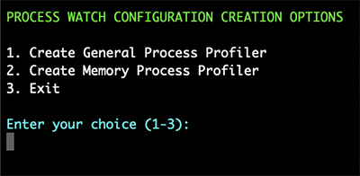
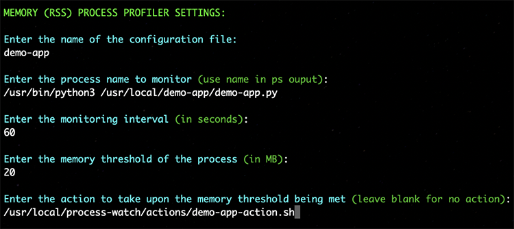

# PROCESS WATCH
* License: (Apache 2.0), Copyright (C) 2025, Author Phil Chen
    * The author or owner of this repository is not liable for damages or losses arising from your use or inability to use the code.

## DESCRIPTION
Process Watch monitors processes and workflows in your Linux system for anomalies or situations which when arise trigger predetermined actions you designate.

This is useful for systems issues, automating troubleshooting, provisioning, scaling, and much more.

## PREREQUISITES
Python 3.11 or higher

## INSTALLATION

### Install Process Watch on Ubuntu

1. `gunzip -c process-watch.tar.gz | tar -xvf - `
2. `mv process-watch /usr/local/`
3. `cd /usr/local/process-watch`
4. `pip install -r requirements.txt`
5. `cd /usr/local/process-watch/systemd`
6. `sudo cp process_watch.service /etc/systemd/system/`
7. `sudo systemctl daemon-reload`
8. `sudo systemctl enable process_watch`
9. `sudo systemctl start process_watch`

## CONFIGURATION

Configuring Process Watch is done through the config_tool located in the tools directory. You will have several options available to you.

1. `cd /usr/local/process-watch/tools`
2. `python3 config_tool.py`

    

### Configure Process Profile Configuration

1. Choose option "Create a Process Profile Configuration"

    

### Create General Process Profiler

1. Choose option "Create General Process Profile"

    

### Create Memory Process Profiler

1. Choose option "Create Memory Process Profile"

    

